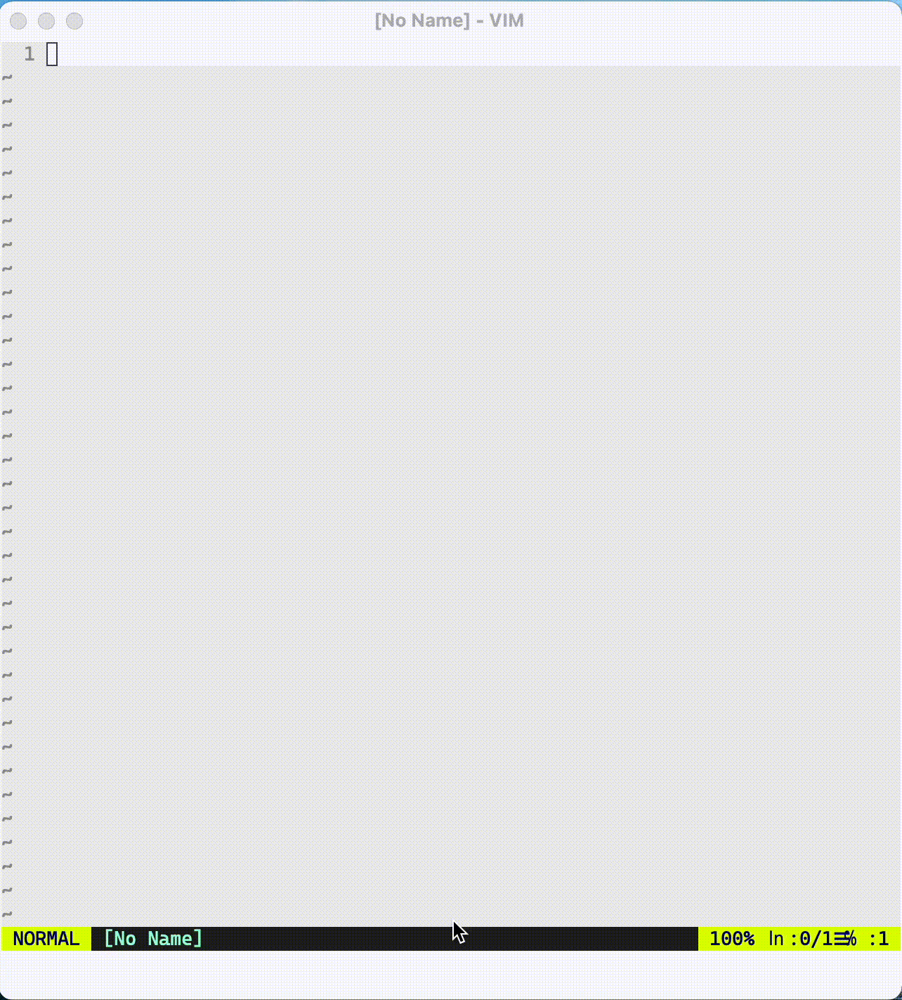

# component-kit.vim

> Toolkit for generate/refract/layout component

⚠️ This plugin need `timers` feature (`:has('timers')`) of vim, executing `:help timers` for more.

## Screenshot



## Introduction

A vue/react/other component is composed by:

1. main file: e.g. `ComponentName.vue`/`ComponentName.tsx`
1. script file (optional): e.g. `ComponentName.js` /`ComponentName.comp.ts`
1. style file (optional): e.g. `ComponentName.css`/`ComponentName.comp.less`/`ComponentName.module.scss`
1. index file (optional): `index.js`/`index.ts`
1. utils files... (optional)

A component may be organized in a folder, e.g.

```bash
components
    ├── ComponentNameA
    │   ├── ComponentNameA.comp.scss      // style file
    │   ├── ComponentNameA.comp.ts        // script file
    │   ├── ComponentNameA.vue            // main file
    │   └── index.ts                      // index file
    │
    └── ComponentNameB
         ├── ComponentNameB.module.scss    // style file
         ├── ComponentNameB.tsx            // main file
         └── index.ts                      // index file
```

Or be organized without a folder, e.g.

```bash
components
    ├── ComponentNameA.comp.scss       // style file
    ├── ComponentNameA.comp.ts         // script file
    ├── ComponentNameA.vue             // main file
    ├── ComponentNameB.module.scss     // style file
    └── ComponentNameB.tsx             // main file

```

## Commands

1. `CompCreate`: create vue component files
    - syntax `:CompCreate ./path/to/ComponentName.[main-extension] [script-extension]? [style-extension]?`
    - create main/script(optional)/style(optional) files
    - see **`CompCreate`/`CompCreateFolder` command arguments**
1. `CompCreateFolder`: like `CompCreate`, create all files under `path/to/ComponentName` folder
    - create main/script(optional)/style(optional)/index files
    - see **`CompCreate`/`CompCreateFolder` command arguments**
1. `CompLayout simple/complex/all/folder`: close all windows and layout complonent files.
1. `CompLayoutAuto simple/complex/all/folder/disable`: set auto layout when opening files
1. `CompAlt`: switch `main file` -> `script file` (optional) -> `style file` (optional) -> `index file` (optional) -> `main file` -> ...
1. `CompRename`: rename all files of a vue component, and change style/script file path in template file
    - `CompRename NewName` will rename vue/style/script file to `NewName.vue`, `NewName.comp.css`, `NewName.comp.js`
1. `CompRenameExt`: rename the extension of style/script file, and change style/script file path in template file
    - e.g. `:CompRenameExt ts`/`:CompRenameExt comp.ts`/`:CompRenameExt module.css`/`:CompRenameExt less`
1. `CompRemove`: remove all files of the component of current buffer
1. `CompFolderize`: change current component to folder structure
1. `CompReset`: reset the status of the plugin

### `:CompLayout`/`:CompLayoutAuto`

A component is composed by:

1. main file
1. script file (optional)
1. style file (optional)
1. index file (optional)
1. utils files... (optional)

-   `folder` = `1 + 2 + 3 + 4 + the component folder`
-   `all` = `1 + 2 + 3 + 4` (default value)
-   `complex` = `1 + 2 +3`
-   `simple` = `1 + 2`

```

 // :CompLayout folder
-----------------
|folder |       |
|       |       |
|-------|       |
| .vue  |       |
|       |       |
|-------|  .js  |
| .css  |       |
|       |       |
|-------|       |
| index |       |
|       |       |
-----------------

 // :CompLayout all
-----------------
| .vue  |       |
|       |       |
|-------|  .js  |
| .css  |       |
|       |       |
|-------|       |
| index |       |
|       |       |
-----------------

 // :CompLayout complex
-----------------
| .vue  |       |
|       |       |
|-------|  .js  |
| .css  |       |
|       |       |
-----------------


 // :CompLayout simple
-----------------
|       |       |
|       |       |
| .vue  |  .js  |
|       |       |
|       |       |
-----------------


```

### `CompCreate`/`CompCreateFolder` command arguments

| command arguments                       | main        | script          | style               | index(`CompCreateFolder`) |
| :-------------------------------------- | :---------- | :-------------- | :------------------ | :------------------------ |
| path/to/Example.vue ts                  | Example.vue | Example.ts      | -                   | index.ts                  |
| path/to/Example.vue comp.ts module.scss | Example.vue | Example.comp.ts | Example.module.scss | index.ts                  |
| path/to/Example.wpy                     | Example.wpy | -               | -                   | index.js                  |
| path/to/Example.wpy comp.js comp.css    | Example.wpy | Example.comp.js | Example.comp.css    | index.js                  |
| path/to/Example.wpy comp.ts module.scss | Example.wpy | Example.comp.ts | Example.module.scss | index.ts                  |
| path/to/Example.jsx                     | Example.jsx | -               | -                   | index.js                  |
| path/to/Example.jsx scss                | Example.jsx | -               | Example.scss        | index.js                  |
| path/to/Example.jsx module.scss         | Example.jsx | -               | Example.module.scss | index.js                  |
| path/to/Example.tsx                     | Example.tsx | -               |                     | index.ts                  |
| path/to/Example.tsx module.scss         | Example.tsx | -               | Example.module.scss | index.ts                  |
| path/to/Example.ts                      | Example.ts  | -               | -                   | index.ts                  |
| path/to/Example.ts scss                 | Example.ts  | -               | Example.scss        | index.ts                  |
| path/to/Example.ts module.scss          | Example.ts  | -               | Example.module.scss | index.ts                  |

## Config

1.  `g:kit_component_template_dir`: The template directory for creating component ( @see `:CompCreate` command ), `template.js` for `.js`, `template.vue` for `.vue`, and so on.
    -   If `g:kit_component_template_dir` is equal `built-in`, the plugin will use template files in this plugin
    -   If `g:kit_component_template_dir` is not set, the plugin will find `.kit-component-template` directory up util home (`~`)
    -   Special words in in template files will be replaced by vue/style/script extension when creating or renaming, see **Special Words In Template**
1.  `g:kit_component_auto_layout`: Call `:CompLayout` automatically when opening `*.vue`/`*.wpy` or `index.js/index.ts` files, only support if vim (8.0+) has `timer_start` command, see `:help timer_start`
    -   If the value is `disable`, no command will be called
    -   If the value is `simple`, command `:CompLayout simple` will be called
    -   If the value is `complex`, command `:CompLayout complex` will be called
    -   If the value is `all`, command `:CompLayout all` will be called
    -   If the value is `folder`, command `:CompLayout folder` will be called

### Special Words In Template

| Special Word       | Meaning                                                           |
| :----------------- | :---------------------------------------------------------------- |
| `ComponentName`    | the component name in pascal case                                 |
| `component-name`   | the component name in kebab case                                  |
| `componentName`    | the component name in camel case                                  |
| `MAIN_EXTENSION`   | the extension for main file, e.g. `vue`/`wpy`/`tsx`               |
| `STYLE_EXTENSION`  | the extension for style file, e.g. `css`/`comp.css`/`module.scss` |
| `STYLE_LANG`       | for vue `lang` attribute, e.g. `scss`/`less`                      |
| `SCRIPT_EXTENSION` | the extension for script file, e.g. `js`/`comp.js`/`comp.ts`      |
| `SCRIPT_LANG`      | for vue `lang` attribute, e.g. `js`/`ts`                          |
| `CREATE_DATE`      | create date, e.g. `2022-08-27`                                    |

## Support

This toolkit supports component like:

1. [Vue](https://vuejs.org/)
1. [wepy](https://github.com/Tencent/wepy)
1. [React](https://reactjs.org/docs/react-component.html)
